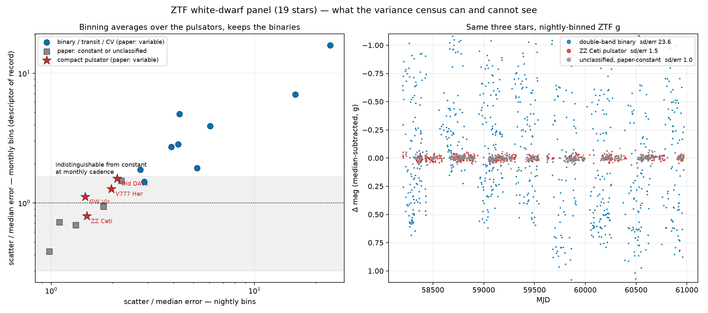
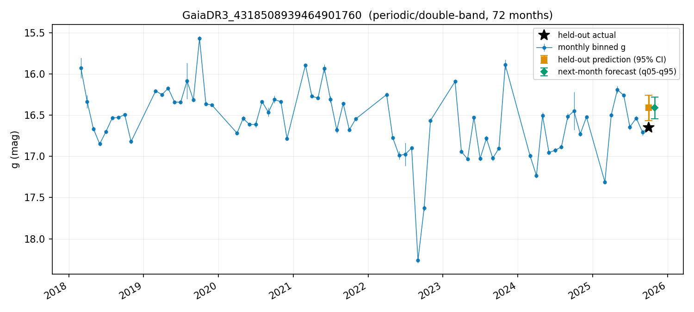
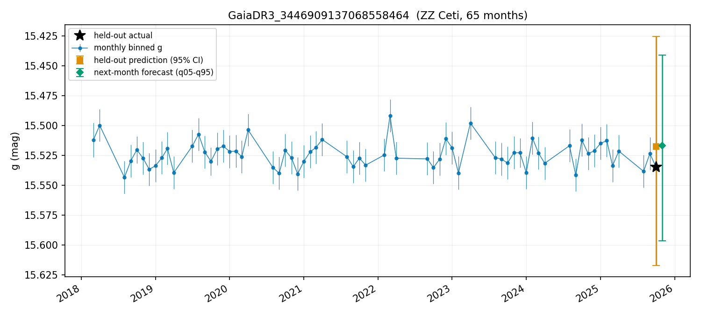
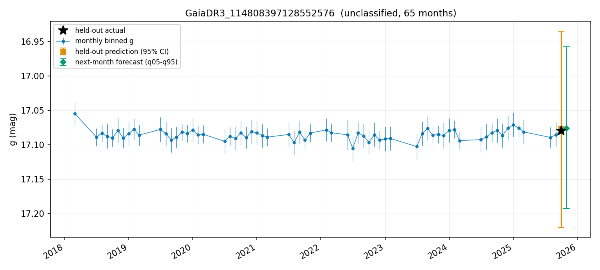

# panelcast-ztf-wd

The first astronomy deployment of [panelcast](https://github.com/cupidthatbtc/panelcast).
It ports ZTF white-dwarf light curves into panelcast's **entity-event panel**
contract and fits them with the same hierarchical random-walk model panelcast
uses for album-rating trajectories — here each white dwarf is an entity and each
observing night is an event.

## What this is

A **19-star** panel of ZTF g/r photometry for the white dwarfs recoverable from
Jestin+2026 ([arXiv:2509.15133](https://arxiv.org/abs/2509.15133)), shaped for
panelcast's entity-event descriptor contract:

- **`data/raw/ztf_wd_panel.csv`** — 19,950 rows, nightly-binned g **and** r
  epochs (one row per white dwarf x band x night).
- **`data/raw/ztf_wd_zg.csv`** — 9,501 rows, the g-band nightly slice fed to the
  `ztf_wd` descriptor.
- **`data/raw/ztf_wd_zg_monthly.csv`** — 1,147 rows, the same g-band series
  re-binned monthly (the descriptor-of-record for the converged fit below).

The panelcast product remains a **per-entity variance census** — the
per-white-dwarf random-walk variance posterior versus Jestin's
variable-vs-constant split. A companion exposure-level Lomb–Scargle analysis now
measures the periodic signals that the binned forecasting panel cannot carry;
it complements the model rather than changing it.

## Full-catalog reconstruction

`catalog-rebuild/` reconstructs the paper's candidate selection without waiting
for the companion VizieR table. The exact Eq. 3 cut yields **22,264** Gaia
sources; the calibrated variability boundary yields **1,423** candidates, with
**1,359** shared by all four plausible recipe variants. The Stage C run at
`outputs/catalog/2026-08-01_full/` then produced:

- **1,423/1,423** terminal IRSA responses under serial 10-arcsec cone searches;
- **928** nearest-source crossmatches with at least 20 clean g and r exposures;
- **203** stars above the 2.5 variance threshold at one or more of six
  exposure/night/month × g/r census combinations;
- **342** two-band/multiband Lomb–Scargle confirmations, **76** one-band
  candidates, and **510** non-detections;
- a converged 928-entity monthly-g panelcast fit (R-hat 1.000, minimum bulk ESS
  3,459, zero divergences).

A post-hoc hardening audit leaves **333** confirmations after excluding >1 mag
Gaia–ZTF mismatches and **311** after combining that cut with a wider daily-alias
screen. Correlation-aware bootstraps strongly support the low-frequency
population; the 65 high-frequency confirmations remain exploratory because only
three of five strong and one of five marginal sampled cases survive at FAP
≤0.05.

The primary within-entity panelcast holdout is accurate and calibrated (MAE
0.0242 mag, R² 0.9984, 80%/95% coverage 0.787/0.928), but it does not beat the
per-star training median (MAE 0.0196). The original entity-disjoint split fails
(MAE 0.634 mag, R² -0.005), and additive Gaia features do not fix it. A new
default-off panelcast seam instead initializes unseen entities from Gaia G,
cutting cold-start MAE to 0.156 and raising R² to 0.799. Train-only Gaia G +
BP−RP correction plus validation conformalization reaches MAE 0.117, R² 0.835,
and 80%/95% coverage 0.829/0.966. The complete review bundle—raw IRSA cache, aggregate panels, per-source period
results, posterior artifacts, calibrated predictions, hashes, and acquisition
provenance—is committed under
`catalog-rebuild/results/2026-08-01_full/`.

## What the panel can carry — and what the binning removes

Before any model runs, the panel itself decides which variability is
recoverable. The census now reports exposure-residual, nightly, and monthly
scatter-to-error ratios in both bands (`python scripts/plot_variance_census.py`):



The compact pulsators pulse on **minutes-to-an-hour** periods. Nightly binning
averages them down and monthly binning finishes the job. The exposure statistic
is the scatter after subtracting each night's median; because the median ZTF
night contains only one exposure, that subtraction also removes much of a
minute-scale signal. It is a high-frequency excess diagnostic, not a substitute
for a coherent periodogram.

| regime | example | g exposure | g night | g month | r exposure | r night | r month |
|---|---|---:|---:|---:|---:|---:|---:|
| double-band binary | `4318508939464901760` | 11.0 | 23.6 | 16.4 | 11.9 | 19.1 | 15.2 |
| WD-MS binary | `1191504471436192512` | 14.0 | 15.9 | 6.9 | 12.3 | 25.9 | 11.8 |
| **pulsator** | ZZ Ceti | **0.5** | **1.5** | **0.8** | **1.2** | **1.4** | **0.8** |
| **pulsator** | GW Vir | **0.7** | **1.5** | **1.1** | **0.9** | **1.2** | **0.6** |
| paper-constant | `114808397128552576` | 0.7 | 1.0 | 0.4 | 1.0 | 1.0 | 0.6 |

The census separates **hours-to-days** variability (binaries, the CV, the
transit) from constant cleanly and is structurally weak for compact pulsators.
That is a property of the event axis, not of the model. A coherent
exposure-level Lomb–Scargle search is deliberately a separate instrument: it can
accumulate phase information across nights without changing panelcast's
nightly/monthly forecasting contract. Read the variance posteriors with that
scope in mind — "recovers the variable-vs-constant split" holds for the
long-period variables only.

Three per-star panels from the converged run, one per regime (all 19 are written
to `<run_dir>/reports/figures_readable/` by `scripts/plot_star_panels.py`):

| high-amplitude binary | pulsator, averaged flat | paper-constant |
|---|---|---|
|  |  |  |

The 19-star panel remains the human-readable validation sample. The full-catalog
run reconstructs the selection directly and keeps the 19 available pilot stars
as controls. One southern RR Lyrae has no IRSA rows within either 10 or 30
arcsec and is recorded as unavailable rather than silently dropped. The full
crossmatch also includes a machine-readable Gaia-versus-ZTF magnitude audit;
20/928 nearest-coordinate matches differ by more than 1 mag and remain included
because the prespecified simplified hygiene rule did not add a magnitude cut.

## Reproduce

The exposure-level analyses require the small scientific stack in
`requirements-lomb-scargle.txt` (`python -m pip install -r requirements-lomb-scargle.txt`).
Build the exposure panel first, then run the smoke test before any blind search:

```text
python scripts/build_exposure_panel.py
python scripts/smoke_test_lomb_scargle.py
python scripts/run_lomb_scargle.py --out-dir outputs/ls/<run>
python scripts/revet_aliases.py --run-dir outputs/ls/<run>
python scripts/extract_literature_periods.py
python scripts/run_directed_search.py --blind-run outputs/ls/<run>
python scripts/run_injection_recovery.py --run-dir outputs/ls/<run>
python scripts/compute_attenuation.py --run-dir outputs/ls/<run>
python scripts/run_bootstrap_fap.py --run-dir outputs/ls/<run>
python scripts/plot_period_results.py --run-dir outputs/ls/<run>
python scripts/generate_results.py --run-dir outputs/ls/<run>
python scripts/validate_lomb_scargle_run.py --run-dir outputs/ls/<run>
```

The reconstructed full catalog is driven in census → Lomb–Scargle → panelcast
order and resumes the fetch, per-star period search, bootstrap, and panelcast
attempts from their machine-readable products:

```text
python scripts/build_catalog_roster.py
python scripts/run_catalog_pipeline.py
python scripts/validate_catalog_rebuild.py --run-dir outputs/catalog/2026-08-01_full
```

The panelcast invocation that converges (run against a panelcast checkout with
this repo's `configs/` and `data/` on the path):

```
panelcast run \
  --dataset configs/datasets/ztf_wd_monthly.yaml \
  --config configs/wd_fit.yaml \
  --no-artist --min-ratings 1 --max-albums 100 \
  --num-chains 4 --num-samples 3000 --num-warmup 3000 \
  --target-accept 0.90 --allow-unlocked-env
```

Diagnostics: **R-hat 1.00, bulk ESS 1,711, 0 divergences in 12,000 draws**.
The command above is canonical; `configs/wd_fit.yaml` carries both
identifiability pins (`heteroscedastic_entity_obs: false`,
`entity_group_pooling: false`).

### The convergence ladder

| Stage | Chains x samples | R-hat | ESS | What changed |
|---|---|---|---|---|
| Nightly | 2 x 500 | 2.44 | 2 | baseline nightly panel |
| Monthly | 4 x 1000 | 2.56 | 5 | monthly binning — multimodality is unidentifiability, not RW length |
| + entity-obs off, artist features off | 4 x 1000 | 1.008 | 395 | removed the unidentifiable components |
| + target-accept 0.90 | 4 x 3000 | 1.00 | 1,197 | mixes well; 2 divergences in the class-pooling funnel |
| + target-accept 0.93 | 4 x 3000 | 1.011 | 789 | 0 divergences via smaller steps — treats the symptom, costs mixing |
| + class pooling off, accept 0.90 | 4 x 3000 | 1.00 | 1,711 | removed the funnel itself — final config |

**Diagnosis.** These are near-constant series, so the model has interchangeable
explanations for the same data: the entity mean, AR persistence, and the random
walk all absorb the (tiny) variation, and global vs per-entity observation noise
trade off freely. Chains settle into different variance attributions — different
modes of one posterior, hence the high R-hat with zero divergences. Removing the
unidentifiable components (per-entity overdispersion and the entity-history
features) collapsed the modes into one. The last two divergences lived in the
class-pooling variance funnel — a between-`wd_class` scale the handful of groups
cannot inform; raising `target-accept` merely tiptoed around it, while dropping
the pooling term removed it and improved mixing at the same time.

## Per-domain verdicts

`heteroscedastic_entity_obs` (per-entity observation noise) is the AOTY default
as of panelcast **v0.13.0**, but is pinned **OFF** here in `configs/wd_fit.yaml`.
At N=19 near-constant series it is unidentifiable against the shared `sigma_obs`
/ `sigma_artist` terms — chains simply reallocate variance between them. This is
not tested here: the 928-entity catalog run deliberately retained the pilot's
identifiability pin so that its posterior lineage stayed comparable. The pin
follows the external-domain run-config pattern from the panelcast v0.13.0
release notes.

`entity_group_pooling` (partial pooling across `wd_class`) is likewise pinned
**OFF**. With only a handful of classes over 19 stars, the between-class
variance is data-starved and its posterior develops the classic hierarchical
funnel — the source of the final 2 divergences on the ladder. Removing it
raised bulk ESS from 1,197 to 1,711 at the same `target-accept`. The 928-entity
catalog run retained the pin for comparability; it converged cleanly but does
not answer whether class pooling is identifiable at that scale.

## Porting gotchas

Found while adapting an album-ratings pipeline to photometry:

- **All-digit Gaia IDs must be carried as strings.** Gaia DR3 `source_id`s are
  19-digit integers; loaded as numerics they lose precision / collide, so the
  entity key is string-typed end to end.
- **AOTY min-obs defaults would delete single-exposure nights.** Most ZTF nights
  are a single exposure (median `n_exp` = 1); the music-domain minimum-ratings
  thresholds would discard the panel. The descriptors set
  `min_obs_thresholds: [1]` to keep everything.
- **The 50-event career cap vs 1000-night light curves.** AOTY entities top out
  at a few dozen releases; a white dwarf has hundreds to a thousand nights. The
  event axis had to be uncapped for the light-curve length.

## Layout

```
configs/
  datasets/ztf_wd.yaml                  nightly g-band descriptor
  datasets/ztf_wd_monthly.yaml          monthly g-band descriptor (19-star fit)
  datasets/ztf_wd_catalog_monthly.yaml  full-catalog monthly descriptor
  wd_fit.yaml                           run-config pins (heteroscedastic_entity_obs: false,
                                        entity_group_pooling: false)
catalog-rebuild/
  CATALOG_PLAN.md                       prespecified reconstruction and Stage C plan
  stageA_eq3_cut.csv                    exact 22,264-source Eq. 3 selection
  stageB_variable_candidates.csv        reconstructed 1,423-source candidate set
scripts/
  run_catalog_pipeline.py       resumable census -> L-S -> panelcast driver
  validate_catalog_rebuild.py   final machine-readable acceptance gate
  fetch_lightcurves.py          resumable IRSA cone-search fetch -> data/raw/lc_cache/
  build_panel.py                bin cached epochs -> data/raw/ztf_wd_panel.csv
  build_exposure_panel.py       quality cuts + BJD_TDB exposure panel and QC tables
  run_lomb_scargle.py           blind two-pass single/multiband LS + BLS control
  revet_aliases.py              reproducible spectral-window/sidereal alias pass
  extract_literature_periods.py sourced frequency table for directed/accuracy tests
  run_directed_search.py        sourced tests at the four tabulated pulsator frequencies
  run_injection_recovery.py     LS/night/month sensitivity grid
  run_bootstrap_fap.py          pass-wide bootstrap maxima for surviving candidates
  compute_attenuation.py        predicted-vs-observed nightly attenuation
  plot_period_results.py        19 periodograms + confirmed phase folds
  generate_results.py           all-star comparison tables and RESULTS.md
  plot_variance_census.py       three-cadence, two-band census -> table + figure
  plot_star_panels.py           readable per-star panels from a panelcast run
figures/
  variance_census.png           exposure/night/month ratios in g+r, all 19 stars
  star_*.png                    three per-star panelcast examples
data/
  roster/jestin2026_roster.csv  the 20-row roster (19 with usable ZTF light
                                curves) + _source_provenance/
  roster/literature_periods.csv sourced directed-search/reference frequencies
  raw/ztf_wd_exposures.csv      quality-filtered exposures with BJD_TDB
  raw/variance_census.csv       three-cadence ratios in both bands
  raw/ztf_wd_panel.csv          nightly g+r panel (19,950 rows)
  raw/ztf_wd_zg.csv             nightly g-band slice (9,501 rows)
  raw/ztf_wd_zg_monthly.csv     monthly g-band slice (1,147 rows)
  raw/lc_cache/                 cached raw IRSA responses (regenerable via fetch)
```

Pipeline byproducts (`data/processed/`, `data/splits/`, `data/features/`,
`data/audit/`, `outputs/`, `models/`, `*.log`) are gitignored; the two scripts
plus a panelcast run regenerate them.

## Data credits & citations

- **ZTF** — Zwicky Transient Facility public data releases; light curves fetched
  from IRSA's login-free `nph_light_curves` service.
- **Gaia DR3** — coordinates and G magnitudes via the Gaia TAP service.
- **Jestin+2026** — [arXiv:2509.15133](https://arxiv.org/abs/2509.15133), source
  of the white-dwarf roster excerpt.
- **panelcast** — https://github.com/cupidthatbtc/panelcast, the model and
  descriptor contract.

The repo retains the paper's named-source roster as a 20-object control set and
also carries the independently reconstructed 1,423-candidate selection under
`catalog-rebuild/`. The reconstruction is not a claim to be the paper's future
VizieR table: its inferred Eq. 4 convention and four-variant 1,359-source core
are preserved explicitly so selection-boundary uncertainty remains auditable.

## License

Code and configs are released under the **MIT License** (see `LICENSE`). The
photometry itself is public survey data credited above and carries the licenses
and acknowledgement requirements of ZTF, Gaia, and IRSA.
