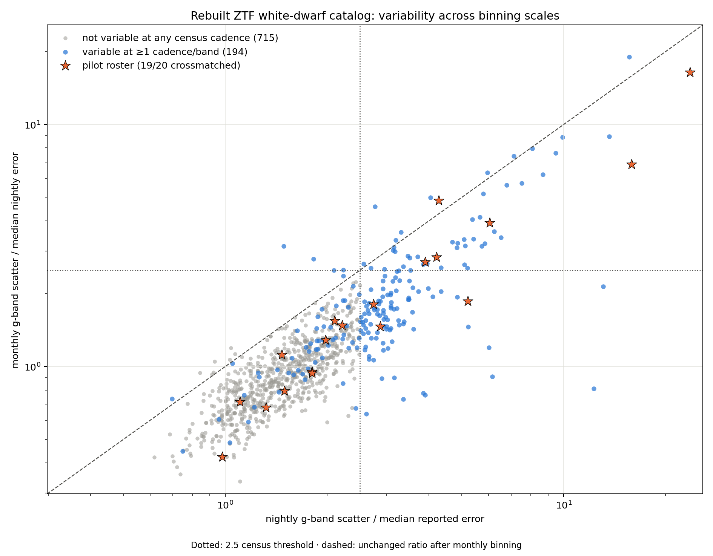
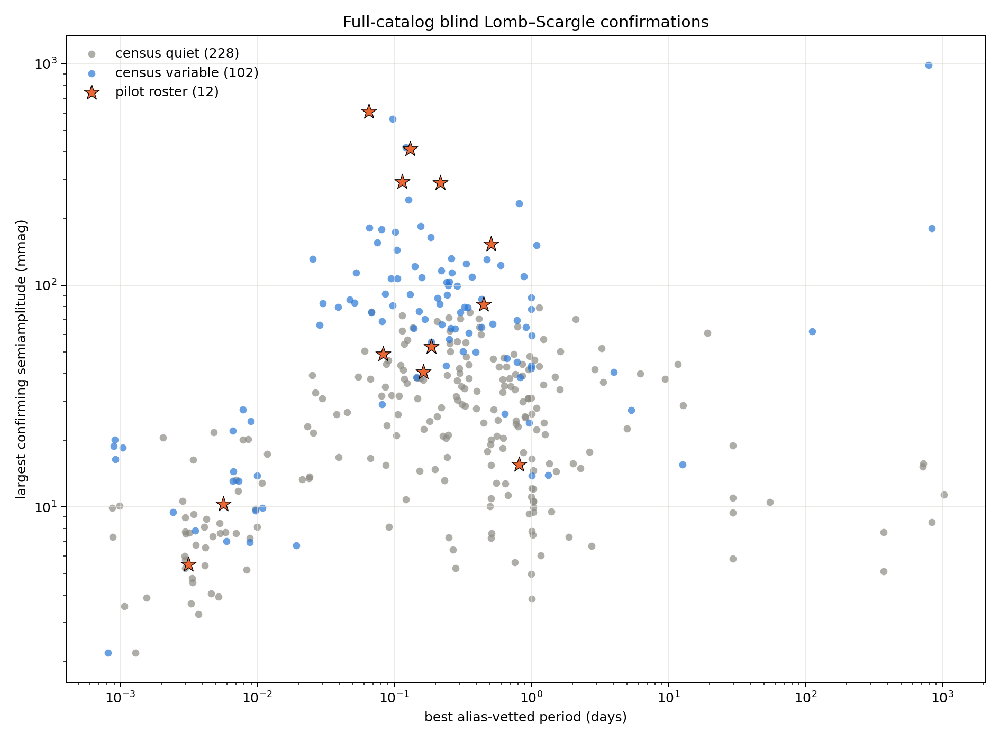

# Full-catalog rebuild — results

Run directory: `2026-08-01_full`. This report is generated from machine-readable outputs; it is intentionally updated after the census, Lomb–Scargle, and panelcast stages.

## Selection provenance

- The Gentile Fusillo main catalog reproduces the paper's Eq. 3 selection exactly: **22,264** sources.
- The reconstructed variability cut contains **1,423** candidates and all **20/20** known roster members.
- Gaia σ(G) uses the inferred per-CCD convention `phot_g_n_obs / 9`. The printed Eq. 4 constants require multiplier **1.1896** to reproduce 1,423, versus **1.25** quoted by the paper.
- Four plausible calibrated recipes agree on **1,359/1,423 (95.5%)** sources; `in_core` and `n_variants` retain that boundary uncertainty per star.

## Census stage

- Cached ZTF responses: **1,423/1,423**; cache/read failures: **0**.
- Crossmatched under the nearest-coordinate-cluster and ≥20 clean exposures in each of g and r rule: **928/1,423**. This is 64 above the paper's 864 cleaned light curves; the simplified prespecified rule has no magnitude-consistency cut.
- Known roster retained: **19/20**. Gaia DR3 `6555925496084361344` is in Stage B but IRSA returned zero g/r rows within both 10 and 30 arcsec; this is an unavailable southern control, not a silent dropout.
- Any of six exposure/night/month × g/r ratios ≥2.5: **203** stars.
- Nightly g ratio ≥2.5: **145**; monthly g ratio ≥2.5: **53**.
- The census is a variance screen, not a periodicity classifier; its count is not expected to equal the paper's 141 periodic stars.

### Known roster

| Gaia DR3 | class | crossmatched | g exp | g night | g month | census |
|---|---|---:|---:|---:|---:|---|
| 103999471976858496 | periodic/transit | yes | 1.12 | 4.21 | 2.83 | variable |
| 114808397128552576 | unclassified | yes | 0.67 | 0.98 | 0.42 | not_variable |
| 1191504471436192512 | WD-MS binaries | yes | 13.99 | 15.87 | 6.85 | variable |
| 1228266814506156928 | unclassified | yes | 0.68 | 1.10 | 0.71 | not_variable |
| 1410345596469085184 | unclassified | yes | 1.95 | 2.22 | 1.48 | not_variable |
| 1510467090935595008 | V777 Her | yes | 1.48 | 1.98 | 1.29 | not_variable |
| 1893101535448502400 | GW Vir | yes | 0.70 | 1.47 | 1.12 | not_variable |
| 1893512958955407232 | unclassified | yes | 1.16 | 1.81 | 0.95 | not_variable |
| 2833849800205759360 | unclassified | yes | 0.87 | 1.32 | 0.68 | not_variable |
| 2935237657195591424 | WD-MS binaries | yes | 1.58 | 6.04 | 3.92 | variable |
| 3345661467822106624 | RRLyrae_contaminant(non-WD) | yes | 0.74 | 3.89 | 2.71 | variable |
| 3446909137068558464 | ZZ Ceti | yes | 0.54 | 1.49 | 0.79 | not_variable |
| 3750072904055666176 | CV(SIMBAD) | yes | 0.15 | 4.27 | 4.85 | variable |
| 3984115430179696128 | Old DAVs | yes | 0.75 | 2.11 | 1.54 | not_variable |
| 4318508939464901760 | periodic/double-band | yes | 10.99 | 23.62 | 16.42 | variable |
| 5146019876066016000 | unclassified | yes | 0.49 | 1.80 | 0.94 | not_variable |
| 6555925496084361344 | RRLyrae_contaminant(non-WD) | no | — | — | — | unavailable |
| 6770227729752288256 | periodic/double-band | yes | 0.70 | 2.87 | 1.46 | variable |
| 6844375121726139520 | periodic/double-band | yes | 0.63 | 2.74 | 1.81 | variable |
| 930093722208184448 | WD-MS binaries | yes | 1.05 | 5.21 | 1.86 | variable |

## Ladder against Jestin et al.

| stage | paper | this rebuild |
|---|---:|---:|
| Eq. 3 selection | 22,264 | 22,264 |
| variability candidates | 1,423 | 1,423 |
| fetched responses | — | 1,423 |
| ZTF crossmatched / clean | 894 → 864 | 928 |
| census-variable | not comparable | 203 |
| L-S periodic | 141 (+ 7 undetermined) | 342 confirmed; 76 one-band candidates |

## Full-catalog Lomb–Scargle

Completed both blind passes for **928/928** crossmatched stars: **342 confirmed**, **76 one-band candidates**.
Known-period sanity gates: **3/3 available controls passed** before the batch; 1 southern RR Lyrae control had zero IRSA rows within both 10 and 30 arcsec and is explicitly unavailable rather than counted as a failure.
The high-frequency residual pass is structurally unavailable for **7** sparse stars with one exposure per night in both bands; their low-frequency result remains valid, and the missing high-pass A95 is labeled rather than reported as a zero limit.
The strongest **30** surviving candidates received 100-resample pass-wide bootstrap tests; values at 0.00990 are a finite resolution floor, not zero.
All selected bootstrap targets came from the **low** pass because many analytic FAPs underflowed to zero; this validates the strongest low-frequency tail, not the high-frequency or marginal-candidate populations.
The blind-spot symmetry is substantial: **233** L-S-confirmed stars are census-quiet, while **94** census-variable stars lack an L-S confirmation.

| direction | Gaia DR3 | period / note |
|---|---|---|
| L-S only | 1081519288218904960 | 0.118385 d |
| L-S only | 1190316479183748992 | 0.114025 d |
| L-S only | 1273088783971336576 | 0.054394 d |
| L-S only | 1622933901956297856 | 0.288460 d |
| L-S only | 1898174235426878208 | 0.248509 d |
| L-S only | 2062408081119518592 | 0.705516 d |
| L-S only | 2833849800205759360 | 0.162697 d |
| L-S only | 506086549232654720 | 0.298151 d |
| L-S only | 1650240032714843008 | 0.791926 d |
| L-S only | 1395293935119779584 | 0.110496 d |
| L-S only | 3370796406708211200 | 0.253982 d |
| L-S only | 1891820737544168576 | 0.288235 d |
| L-S only | 1709387775398437760 | 0.309418 d |
| L-S only | 4608235514718975104 | 0.447014 d |
| L-S only | 374333032939743488 | 0.415273 d |
| L-S only | 187576000803144704 | 0.282687 d |
| L-S only | 2206722349507123456 | 0.066580 d |
| L-S only | 1534384148897669248 | 0.356559 d |
| L-S only | 2191618770599895296 | 0.090404 d |
| L-S only | 1755694777053825792 | 0.205387 d |
| L-S only | 1286055427676135808 | 0.969650 d |
| L-S only | 953685015492787456 | 0.614379 d |
| L-S only | 3721943209023827456 | 0.114367 d |
| L-S only | 1527701145426221824 | 0.428986 d |
| L-S only | 2048212728863128064 | 1.626524 d |
| L-S only | 2375576682347401216 | 0.025219 d |
| L-S only | 1112171030998592256 | 0.103064 d |
| L-S only | 1940056553173007488 | 0.860778 d |
| L-S only | 551153263105246208 | 0.095380 d |
| L-S only | 1879989790567353344 | 0.772502 d |
| L-S only | 335495116856304256 | 0.348546 d |
| L-S only | 2043899619620928000 | 0.068086 d |
| L-S only | 920621124593362816 | 0.866057 d |
| L-S only | 381335822504421376 | 1.047960 d |
| L-S only | 4234317757878747776 | 0.398758 d |
| L-S only | 2672992211134257152 | 0.303178 d |
| L-S only | 1797734879016276096 | 0.999090 d |
| L-S only | 1158050898150073472 | 1.228544 d |
| L-S only | 459237630076876672 | 0.530925 d |
| L-S only | 535357713421191168 | 0.147412 d |
| census only | 1110291480292939136 | no confirmed blind period |
| census only | 1160300056558791168 | no confirmed blind period |
| census only | 1180021786172275712 | no confirmed blind period |
| census only | 1325292217371985024 | no confirmed blind period |
| census only | 136610338318092544 | no confirmed blind period |
| census only | 1470268533506847744 | no confirmed blind period |
| census only | 1474090607723007104 | no confirmed blind period |
| census only | 1479182789667845376 | no confirmed blind period |
| census only | 152371871863155840 | no confirmed blind period |
| census only | 1641326979142898048 | no confirmed blind period |
| census only | 177368203568437120 | no confirmed blind period |
| census only | 1819329248736952704 | no confirmed blind period |
| census only | 1862796379351925888 | no confirmed blind period |
| census only | 1944856063168152832 | no confirmed blind period |
| census only | 1987013675437179008 | no confirmed blind period |
| census only | 2052465197458897280 | no confirmed blind period |
| census only | 2173871656498100096 | no confirmed blind period |
| census only | 2177866074856588928 | no confirmed blind period |
| census only | 2338349628107880192 | no confirmed blind period |
| census only | 2371650330620404224 | no confirmed blind period |
| census only | 2488974302977323008 | no confirmed blind period |
| census only | 2584756467429594880 | no confirmed blind period |
| census only | 2611423167751076224 | no confirmed blind period |
| census only | 2614454620092715776 | no confirmed blind period |
| census only | 2660358032257156736 | no confirmed blind period |
| census only | 2754909740118313344 | no confirmed blind period |
| census only | 2842650153836732928 | no confirmed blind period |
| census only | 2970066126811876992 | no confirmed blind period |
| census only | 3012407808497574272 | no confirmed blind period |
| census only | 3040572859699144960 | no confirmed blind period |
| census only | 3041064135238502656 | no confirmed blind period |
| census only | 3058706490797990016 | no confirmed blind period |
| census only | 3070046750645458048 | no confirmed blind period |
| census only | 307323228064848512 | no confirmed blind period |
| census only | 3169486960220617088 | no confirmed blind period |
| census only | 3169614331770315392 | no confirmed blind period |
| census only | 3224908977688888064 | no confirmed blind period |
| census only | 3237854863817516544 | no confirmed blind period |
| census only | 3301217592917972864 | no confirmed blind period |
| census only | 3425718245172233984 | no confirmed blind period |
| … | full lists | `ls_census_disagreement.csv` |

## Full-catalog panelcast fit

The nearest-coordinate crossmatch leaves **20/928** sources whose median ZTF g differs from Gaia G by more than 1 mag. They are retained because the prespecified simplified hygiene rule contains no magnitude cut; `panelcast_crossmatch_magnitude_audit.csv` makes the sensitivity concern explicit.

Status: **converged** after 1 attempt(s).

The final attempt met all prespecified sampling diagnostics. The primary within-entity-temporal holdout is well calibrated, while the optional entity-disjoint cold-start split fails badly and must not be interpreted as validated out-of-entity prediction. Posterior scalar estimates are compared with the 19-star pilot in `posterior_scalars_vs_pilot.csv`.

| diagnostic | full catalog | acceptance |
|---|---:|---:|
| max R-hat | 1.0000 | ≤1.01 |
| min bulk ESS | 3459 | ≥400 |
| divergences | 0 | 0 |
| primary MAE | 0.02422 | — |
| primary RMSE | 0.03604 | — |
| primary R² | 0.9984 | — |
| primary 80% coverage | 0.787 | 0.80 |
| primary 95% coverage | 0.928 | 0.95 |
| entity-disjoint MAE | 0.63439 | — |
| entity-disjoint RMSE | 0.82955 | — |
| entity-disjoint R² | -0.0053 | — |
| entity-disjoint 80% coverage | 0.058 | 0.80 |
| entity-disjoint 95% coverage | 0.104 | 0.95 |
| prior-predictive fraction in bounds | 0.777 | informational |

Raw offset-logit scalars are not directly comparable because the full and pilot descriptors use different target bounds. The magnitude-equivalent columns invert the location or apply a local delta-method scale.

| posterior scalar | latent full | latent pilot | mag-equivalent full | mag-equivalent pilot |
|---|---:|---:|---:|---:|
| mu_artist | 0.72284 | -0.09000 | 16.90555 | 16.79207 |
| sigma_artist | 0.00338 | 0.63000 | 0.00818 | 0.75447 |
| sigma_obs | 0.01007 | 0.02644 | 0.02436 | 0.03166 |

## Post-hoc hardening audit

Hardening acceptance: **passed**. The prespecified 342-confirmation result is unchanged; **333** survive the >1 mag crossmatch sensitivity cut and **311** survive that cut together with the wider daily-systematics screen.

The correlation-aware bootstrap validates all five strong and four of five marginal low-frequency confirmations. High-frequency survival is weaker: three of five strong and one of five marginal confirmations pass at FAP ≤0.05, so the 65 high-pass confirmations remain exploratory.

The original panelcast fit does not beat the exact-split entity-median baseline (MAE **0.01962**), and the additive Gaia-feature sensitivity was rejected. Native Gaia initialization repairs cold start (MAE **0.15626**, R² **0.799**). Train-only Gaia G + BP−RP correction plus validation conformalization reaches MAE **0.11729**, R² **0.835**, and 80%/95% coverage **0.829/0.966**; the standalone Gaia benchmark is MAE **0.11664**.

Eight bootstrap strata are recorded in `hardening/stratified_bootstrap/summary.csv` (40 sources). Full interpretation is in `hardening/HARDENING_RESULTS.md`.

## Traceability and guardrails

- `census_full_catalog.csv`: one row per crossmatched star, all six ratios and census verdict.
- `crossmatch_qc.csv`: every Stage B candidate, including missing/failed responses and row-rejection counts.
- `ls_full_catalog.csv`: one row per crossmatched star when the L-S stage is complete.
- `panelcast_crossmatch_magnitude_audit.csv`: Gaia-versus-ZTF median-magnitude audit for every retained crossmatch.
- The converged pilot directory `outputs/2026-07-18_151420_993941_17ac` and pilot L-S directory `outputs/ls/2026-08-01_full` were not modified or rerun.
- The run was completed and accepted before publication; the review bundle is proposed in PR #1 and remains unmerged.
