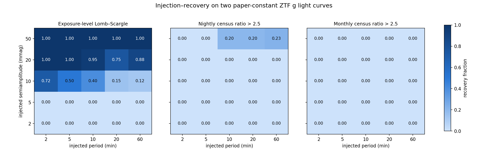
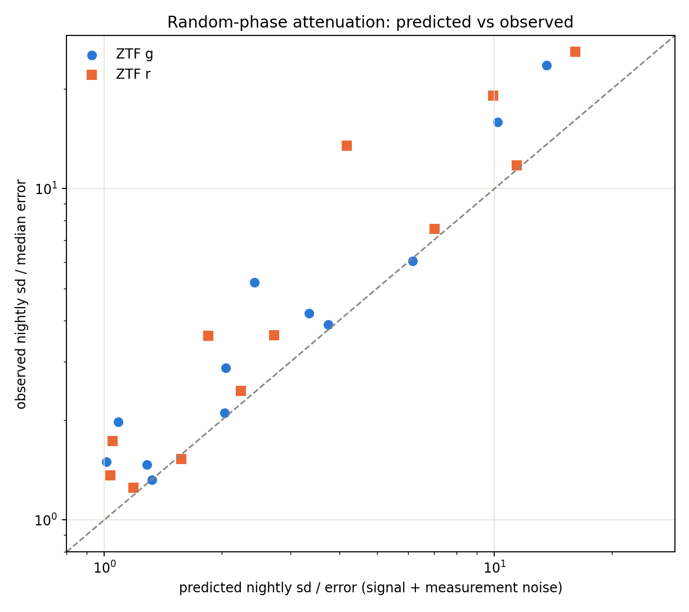

# Lomb–Scargle × panelcast census — results

Run directory: `2026-08-01_full`. All values below are generated by scripts in `scripts/`; the converged panelcast run was not touched.

## Executive result

- The nightly g-band census recovered **9/13** paper-variable stars.
- The blind, alias-vetted Lomb–Scargle search recovered **11/13**. Directed tests added no detections at the tabulated frequencies, so the total L-S count remained **11/13**.
- Their union recovered **13/13**: L-S supplied the four named pulsators; the census supplied the CV and the double-band object `6844375121726139520` that L-S missed.
- Among 5 usable paper-constant stars, both methods had **0 confirmed false alarms**. L-S left one one-band long-period candidate (`1228266814506156928`), labeled candidate rather than detection.
- The original oddball `1410345596469085184` is **g only marginal artifact**: no alias-vetted periodicity; g ratios 1.95/2.22/1.48 versus r 1.42/1.73/0.82 (exposure/night/month), all below the 2.5 census threshold.

## Controls and search validation

- End-to-end smoke injection: 8.000 min, 30 mmag injected *before* nightly detrending; recovered 7.999998459 min with blind-grid Baluev FAP 1.90e-15. Nightly median subtraction attenuated the measured semiamplitude to 7.23 mmag, but did not erase the period.
- RR Lyrae positive control: P = 0.217036609 d, FAP <1e-300; the phase fold is visibly asymmetric/non-sinusoidal ([figure](figures/phase_folds/phase_fold_3345661467822106624.png)).
- Double-band positive control: P = 0.064854041 d, confirmed in g+r, FAP <1e-300 ([figure](figures/phase_folds/phase_fold_4318508939464901760.png)).
- Transit/eclipsing object: L-S P = 0.449768882 d; BLS P = 0.449778891 d with depth S/N 49.2.
- Bootstrap FAPs used 100 resamples with an add-one floor of 1/101 and a two-samples-per-peak pass-wide grid for 13 surviving candidates.

Blind FAPs are Baluev search-maximum probabilities over the stated pass. Multiband power itself has no Astropy FAP; detections use the confirming single-band FAPs. High-frequency grids contain about 30–39 million frequencies per series and were evaluated in 500,000-frequency chunks. Alias vetting rejects peaks within 1.5/T of a spectral-window peak with normalized power ≥0.1 and sidereal-day families.

## Master table — 19/19 usable stars

| Gaia DR3 | WDJ | class | paper var | paper periodic | census night g | census month g | blind LS | best period | Baluev FAP | amplitude / limit | directed | concordance |
|---|---|---|---|---|---|---|---|---|---|---|---|---|
| 1510467090935595008 | WDJ135309.97+484021.17 | V777 Her | True | True | 1.98 | 1.29 | confirmed | 489.26 s | 3.31e-16 | A_g=10.3 mmag | not_detected | paper-variable: LS only |
| 3446909137068558464 | WDJ052038.32+304823.92 | ZZ Ceti | True | True | 1.49 | 0.79 | confirmed | 271.71 s | 9.31e-07 | A_g=2.9 mmag | not_detected | paper-variable: LS only |
| 3984115430179696128 | WDJ111026.19+191229.75 | Old DAVs | True | True | 2.11 | 1.54 | confirmed | 0.186040 d | 2.30e-75 | A_g=53.0 mmag | not_detected | paper-variable: LS only |
| 2935237657195591424 | WDJ070223.05-174931.25 | WD-MS binaries | True | True | 6.04 | 3.92 | confirmed | 0.113440 d | <1e-300 | A_g=140.0 mmag | not_applicable | paper-variable: census+LS |
| 1893101535448502400 | WDJ220247.69+275010.67 | GW Vir | True | True | 1.47 | 1.12 | confirmed | 0.815584 d | 6.34e-102 | A_g=15.5 mmag | not_detected | paper-variable: LS only |
| 3750072904055666176 | WDJ105010.80-140436.76 | CV(SIMBAD) | True | False | 4.27 | 4.85 | not_detected | 0.997636 d (alias-rejected) | 1.59e-43 | A95 g=43.6 mmag | not_applicable | paper-variable: census only |
| 1228266814506156928 | WDJ143406.77+150817.81 | unclassified | False | False | 1.10 | 0.71 | candidate | 333.314897 d | 2.10e-10 | A_g=5.9 mmag | not_applicable | paper-constant: one-band candidate |
| 114808397128552576 | WDJ024849.59+264332.15 | unclassified | False | False | 0.98 | 0.42 | not_detected | 0.196607 d | 9.47e-02 | A95 g=3.8 mmag | not_applicable | paper-constant: quiet |
| 1410345596469085184 | WDJ163914.29+474835.84 | unclassified | False | False | 2.22 | 1.48 | not_detected | 0.999903 d | 3.32e-01 | A95 g=8.7 mmag | not_applicable | paper-constant: quiet |
| 5146019876066016000 | WDJ022917.15-150350.42 | unclassified | False | False | 1.80 | 0.94 | not_detected | 69.81 s | 6.78e-03 | A95 g=9.8 mmag | not_applicable | paper-constant: quiet |
| 1893512958955407232 | WDJ220420.60+282321.36 | unclassified | False | False | 1.81 | 0.95 | not_detected | 0.030054 d | 2.81e-02 | A95 g=7.6 mmag | not_applicable | paper-constant: quiet |
| 103999471976858496 | — | periodic/transit | True | True | 4.21 | 2.83 | confirmed | 0.449769 d | 9.80e-184 | A_g=82.2 mmag | not_applicable | paper-variable: census+LS |
| 1191504471436192512 | — | WD-MS binaries | True | True | 15.87 | 6.85 | confirmed | 0.130080 d | <1e-300 | A_g=217.1 mmag | not_applicable | paper-variable: census+LS |
| 930093722208184448 | — | WD-MS binaries | True | True | 5.21 | 1.86 | confirmed | 0.509092 d | 3.60e-268 | A_g=67.5 mmag | not_applicable | paper-variable: census+LS |
| 4318508939464901760 | — | periodic/double-band | True | True | 23.58 | 16.42 | confirmed | 0.064854 d | <1e-300 | A_g=608.3 mmag | not_applicable | paper-variable: census+LS |
| 6770227729752288256 | — | periodic/double-band | True | True | 2.87 | 1.46 | confirmed | 0.083054 d | 1.46e-24 | A_g=48.9 mmag | not_applicable | paper-variable: census+LS |
| 6844375121726139520 | — | periodic/double-band | True | True | 2.74 | 1.81 | not_detected | 637.71 s | 3.97e-01 | A95 g=2.8 mmag | not_applicable | paper-variable: census only |
| 2833849800205759360 | — | unclassified | — | — | 1.32 | 0.68 | confirmed | 0.162697 d | <1e-300 | A_g=16.2 mmag | not_applicable | paper flag unavailable |
| 3345661467822106624 | — | RRLyrae_contaminant(non-WD) | True | True | 3.89 | 2.71 | confirmed | 0.217037 d | <1e-300 | A_g=133.4 mmag | not_applicable | paper-variable: census+LS |

Full machine-readable columns, including both bands at all three cadences, BLS, bootstrap FAP, and all four A95 limits: [`master_table.csv`](master_table.csv).

## Directed searches at published pulsator frequencies

Jestin et al. report frequencies to only 0.01 d^-1. The exact tabulated value is therefore shown as a true single-trial test; a second targeted test searches its ±0.005 d^-1 rounding interval and pays that interval's trials factor. Daily aliases through ±3 sidereal days are recorded in `directed_search_aliases.csv`. The high-frequency residual definition was retained even for the two tabulated frequencies below 24 d^-1, as specified in the plan.

| Gaia DR3 | class | lit f/d | g exact FAP | r exact FAP | refined f/d | g targeted FAP | r targeted FAP | verdict |
|---|---|---|---|---|---|---|---|---|
| 1510467090935595008 | V777 Her | 176.58 | 5.62e-01 | 2.69e-03 | 176.584959 | 1.00e+00 | 9.96e-02 | not_detected |
| 3446909137068558464 | ZZ Ceti | 320.01 | 6.99e-01 | 8.48e-01 | 320.005687 | 1.00e+00 | 1.00e+00 | not_detected |
| 3984115430179696128 | Old DAVs | 5.38 | 1.24e-01 | 5.42e-01 | 5.375138 | 1.00e+00 | 1.00e+00 | not_detected |
| 1893101535448502400 | GW Vir | 1.23 | 8.22e-01 | 8.15e-01 | 1.226018 | 1.00e+00 | 1.00e+00 | not_detected |

No exact-name/Gaia-ID SIMBAD or VizieR search surfaced a separate period source for these four objects; the directed input is the Jestin et al. companion-table excerpt ([arXiv:2509.15133](https://arxiv.org/abs/2509.15133)).

## Period accuracy

| Gaia DR3 | reference f/d | blind f/d | reference P (s) | blind P (s) | ΔP (s) | nearest sidereal order | directed verdict |
|---|---|---|---|---|---|---|---|
| 1510467090935595008 | 176.5800 | 176.591681 | 489.297 | 489.264 | -0.032 | 0 | not_detected |
| 3446909137068558464 | 320.0100 | 317.980884 | 269.992 | 271.714 | +1.723 | -2 | not_detected |
| 3984115430179696128 | 5.3800 | 5.375201 | 16059.480 | 16073.818 | +14.339 | 0 | not_detected |
| 1893101535448502400 | 1.2300 | 1.226115 | 70243.902 | 70466.446 | +222.543 | 0 | not_detected |
| 2833849800205759360 | 6.1464 | 6.146410 | 14057.009 | 14056.987 | -0.022 | 0 | not_applicable |

The 6.1464 d^-1 reference for `2833849800205759360` is from the Jestin et al. Figure 3 caption. The V777 Her and ZZ Ceti blind peaks are not consistent with the two-decimal tabulated frequencies at 7.5-year coherent precision; this is reported rather than silently snapping them to the literature values.

## Sensitivity

The injection grid uses two paper-constant g-band light curves, five periods, five semiamplitudes, and 20 random phases per star/cell (40 injections per cell). L-S recovery evaluates the injected-frequency resolution element but applies the full 24–1440 d^-1 Baluev trials penalty. The nightly and monthly detectors rebuild their bins and use the same 2.5 threshold as the census.

At 20 mmag, L-S recovery ranged from 0.75 to 1.00; nightly recovery was zero, and monthly recovery was zero. At 50 mmag, L-S was 1.00 in every period cell; the nightly census recovered at most 0.23, and monthly remained zero. At 2–5 mmag all three methods failed, which bounds the claim.

A95 is the 95th percentile of deterministically sampled independent local noise peaks, converted to semiamplitude with the weighted LS normalization. Every pass-level non-detection has a two-band limit in [`non_detection_upper_limits.csv`](non_detection_upper_limits.csv); no table cell is blank.

## Attenuation loop

For every blind-confirmed star, predicted signal variance uses `A²/2 × mean(1/n_exp)` and adds unit measurement-noise variance before comparison with the observed nightly ratio. Across 24 star-band points the median observed/predicted ratio is 1.32; departures are expected for eclipse/RR-Lyrae shapes and residual aperiodic variance.

Full arithmetic: [`attenuation.csv`](attenuation.csv).

## Oddball verdict

`1410345596469085184` has no surviving low- or high-frequency peak. Its r-band ratios fall with binning and never approach the threshold; the g nightly value 2.22 is marginal rather than corroborated. The prior census-only claim is therefore retracted as a g-only marginal artifact, not promoted to an aperiodic two-band detection.

## Figures and traceability

- [Three-cadence × two-band census](../../../figures/variance_census.png)
- [Injection recovery](figures/injection_recovery.png)
- [Attenuation](figures/attenuation.png)
- `figures/periodograms/`: both passes for all 19 stars, with vetted aliases marked.
- `figures/phase_folds/`: one fold for every blind-confirmed detection.
- QC: repository tables `data/raw/ztf_wd_exposure_qc.csv` and `data/raw/ztf_wd_exposure_summary.csv`.

## Acceptance checklist

- [x] Smoke-test injection recovered before real-run interpretation
- [x] RR Lyrae and double-band controls recovered with periods stated
- [x] QC table reports kept/dropped rows for all 20 roster stars × two bands
- [x] BJD_TDB used in the high-frequency pass
- [x] Master table covers 19/19 usable stars
- [x] Every named pulsator has blind result, sourced directed result, and A95 if directed-undetected
- [x] Every surviving best candidate has a pass-wide bootstrap FAP from at least 100 resamples
- [x] Injection grid computed for all three detectors
- [x] Attenuation table covers every blind-confirmed detection
- [x] Oddball has a three-way verdict
- [x] Nothing under `outputs/2026-07-18_151420_993941_17ac` was modified or rerun
- [x] Nothing was pushed

The optional r-band monthly panelcast refit was not run; the plan marks it strictly lower priority than the completed periodogram comparison, and no model changes were made.

## Method limitations recorded, not hidden

1. Per-night median subtraction strongly attenuates minute-scale signals on nights with one or two exposures; the smoke test and injection grid quantify that loss.
2. The BLS auto-grid implied 24.5 billion periods, so the implemented blind coverage uses a 200,000-period log grid over 1 hour–30 days and refines the best 20 neighborhoods with 2,001 periods each. It recovered the same 0.44977 d signal as L-S.
3. The published pulsator frequencies have only two decimal places, far coarser than a 7.5-year coherent resolution element; exact and rounding-interval directed tests are reported separately.
4. One-band peaks remain candidates everywhere, even when their analytic FAP is small.
5. Bootstrap maxima use two samples per independent peak rather than the blind search's tenfold localization grid; this preserves the pass-wide trials test while keeping 100 resamples feasible. Values at the 1/101 floor are reported as such, not as zero.
